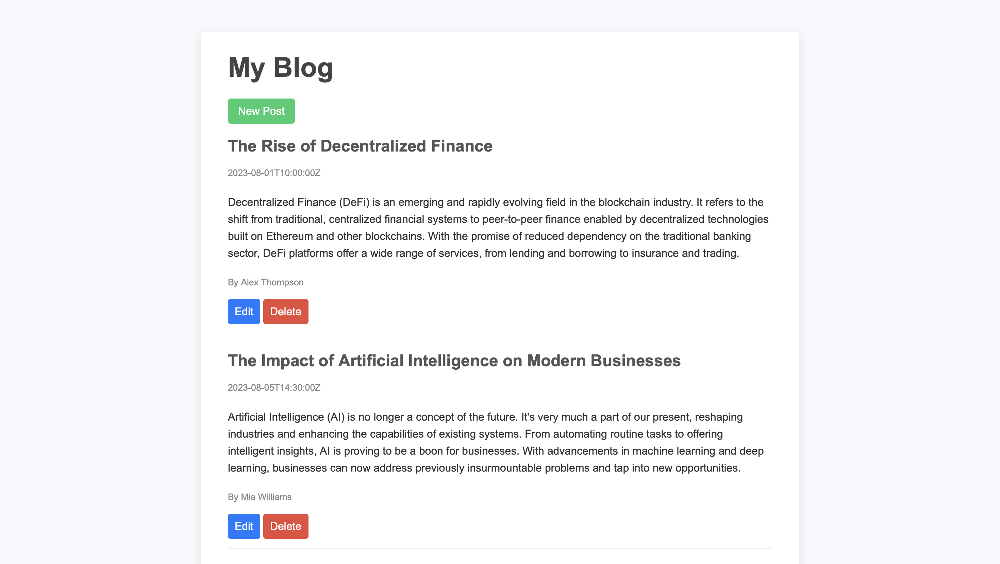
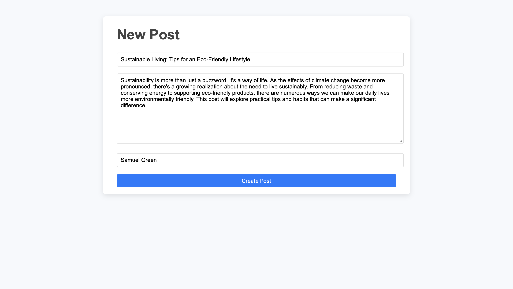
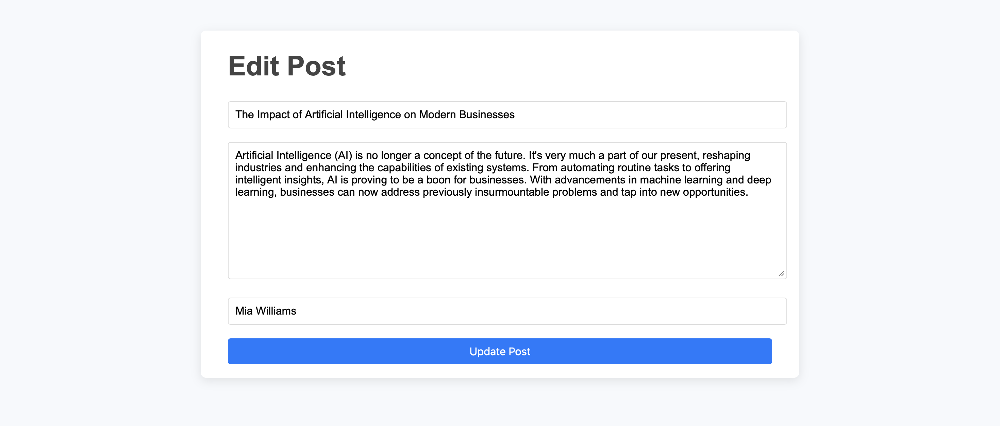

# 📰 Blog API

A **full-stack** Medium-style blog platform built using **Node.js**, **Express**, **EJS**, and **Axios**.<br>
The project includes:<br>
- A fully functional **REST API** for managing blog posts
- A dynamic front-end website rendered with EJS templates
- Full **CRUD** operations (Create, Read, Update, Delete)
- Clean separation between the API server and client server

---

## ✨ Features

### 🔌 API Features
- GET /posts — View all posts
- GET /posts/:id — View a single post
- POST /posts — Create a post
- PATCH /posts/:id — Update a post
- DELETE /posts/:id — Delete a post
- JSON responses
- Stores posts in memory

### 🖥️ Frontend Features
- Homepage displays all blog posts
- View full blog content
- Create new posts
- Edit/update existing posts
- Delete posts
- Axios-powered API communication
- EJS-based templating (index.ejs, modify.ejs)

---

## 🚀 Tech Stack

### Backend API (PORT 4000)
- Node.js
- Express
- REST API
- In-memory datastore

### Frontend Website (PORT 3000)
- Express + EJS
- Axios
- Static assets via /public

---

## Home Page


## Add New


## Edit 


---

## ⚙️ Installation & Setup
   ```bash
   git clone https://github.com/abdullahali785/BlogAPI.git
   cd BlogAPI

   npm intall
   node index.js
   node server.js
   ```
   
   Blog App will be live at http://localhost:3000

⚡ Run both servers in separate terminals:

Terminal 1 → Start the API (runs on port 4000)
node index.js

Terminal 2 → Start the frontend (runs on port 3000)
node server.js
